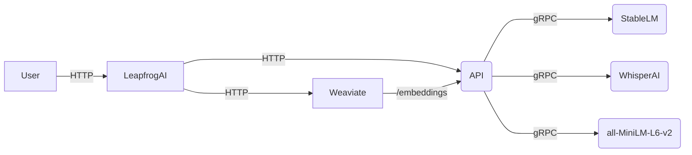

## Table of Contents
1. [Project Goal](#project-goal)
2. [Why Host Your Own LLM?](#why-host-your-own-llm)
3. [Features](#features)
4. [Getting Started](#getting-started)
5. [Usage](#usage)
7. [License](LICENSE)
8. [Community](#community)

## Project Goal <a name="project-goal"></a>

LeapfrogAI is designed to provide AI-as-a-service in egress limited environments. This project aims to bridge the gap between resource-constrained environments and the growing demand for sophisticated AI solutions, by enabling the hosting of APIs that provide AI-related services.

Our services include vector databases, completions with models like Large Language Models (LLMs), and the creation of embeddings. These AI capabilities can be easily accessed and integrated with your existing infrastructure, ensuring the power of AI can be harnessed irrespective of your environment's limitations.

## Why Host Your Own LLM? <a name="why-host-your-own-llm"></a>

Large Language Models (LLMs) are a powerful resource for AI-driven decision making, content generation, and more. However, the use of cloud-based LLMs can introduce limitations such as:

* **Data Privacy and Security**: Sending sensitive information to a third-party service may not be suitable or permissible for all types of data or organizations. By hosting your own LLM, you retain full control over your data.

* **Cost**: Pay-as-you-go AI services can become expensive, especially when large volumes of data are involved. Running your own LLM can often be a more cost-effective solution in the long run.

* **Customization and Control**: By hosting your own LLM, you have the ability to customize the model's parameters, training data, and more, tailoring the AI to your specific needs.

* **Latency**: If your application requires real-time or near-real-time responses, hosting the model locally can significantly reduce latency compared to making a round trip to a remote API.

## Features <a name="features"></a>

* LeapfrogAI provides an API that closely matches that of OpenAI's. This feature allows tools that have been built with OpenAI/ChatGPT to function seamlessly with LeapfrogAI as a backend. This compatibility greatly simplifies the transition process for developers familiar with OpenAI's API, and facilitates easy integration with existing systems.

* Vector Databases: Our vector database service allows you to perform efficient similarity searches on large scale databases. This feature can be utilized to augment prompts with responses from VectorDBs, enhancing the contextual awareness of the model.

* Fine-Tuning Models: One of the key strengths of LeapfrogAI is its ability to leverage customer specific data. We provide capabilities to fine-tune models with your data, enabling the AI to better understand your domain and provide more accurate and contextually relevant outputs.

* Embeddings Creation: Embeddings are fundamental to the working of many AI algorithms. LeapfrogAI provides services to generate embeddings which can be used for a variety of tasks such as semantic similarity, clustering, and more.

## Architecture

Leapfrog exposes both Weaviate and LLM and embedding generative capabilities over HTTP.  However, internal communications are a combination of gRPC and HTTP connections as described below:



## Getting Started <a name="getting-started"></a>

### Setting up the Kubernetes Cluster

LeapfrogAI's API server and [weaviate](https://github.com/weaviate/weaviate)'s vector database don't require GPUs, however some models will not function without GPUs.  If using a CPU based platform, see the [ctransformers](./models/llms/ctransformers/) folder for working with GGML architectures.

#### K3d w/ GPU support

If developing on a node that has a GPU, there's a Zarf package that deploys a k3d cluster with GPU support clone and follow the instructions in the repository [here](https://github.com/defenseunicorns/zarf-package-k3d-airgap).

on a node with at least 1 GPU

#### Initialize Cluster

The supported install method uses [zarf](https://zarf.dev) to initialize the cluster and then deploy [Big Bang](https://github.com/defenseunicorns/uds-package-dubbd) on top:

```shell
zarf init -a amd64
zarf package deploy oci://ghcr.io/defenseunicorns/packages/dubbd-k3d:0.11.0-amd64 --set APPROVED_REGISTRIES="ghcr.io/runyontr/* | ghcr.io/defenseunicorns/* | nvcr.io/nvidia/k8s/* | semitechnologies/*"
```


### Deploy

To build and deploy Leapfrg

```shell
zarf package create .
zarf package deploy zarf-package-leapfrogai-*.zst --confirm
```

### Configure DNS

Ensure that the DNS record for `*.bigbang.dev` points to the load balancer for Istio.  By default this DNS record points at localhost, so for the k3d deployment, this should work out of the box with the load balancers configured.


The OpenAI API service is hosted and is watching for new models to get installed in the cluster.

### Install a model

```shell
$ cd models/test/repeater
$ zarf package create .
$ zarf package deploy zarf-package-*.zst --confirm
$ kubectl get pods -n leapfrogai
NAME                              READY   STATUS    RESTARTS   AGE
api-deployment-65cd6fbf95-l5dzw   2/2     Running   0          5m23s
```


## Usage <a name="usage"></a>

Reference one of the ipythonnotebooks that showcase a simple getting started.


# Leapfrog AI

Leapfrog AI is a deployable AI-as-a-service that brings the capabilities of AI models to egress limited environments by allowing teams to deploy APIs that mirror OpenAI's spec.  Teams are able to use tools built around OpenAIs models in their own environment, preventing the release of proprietary and sensitive data to SaaS tools.

In addition, tools like [Weaviate](https://weaviate.io/) are deployed to allow for the creation of content augmented applications.


## Create the API Server

See the [Getting Started Notebook](notebooks/gettingstarted.ipynb) for example of using the API with the OpenAI python module.


# Building `leapfrogai` and updating PyPi

1. Change the version in `pyproject.toml`
2. `python3 -m pip install --upgrade build hatchling twine`
3. `python3 -m build`
4. `python3 -m twine upload dist/*`


# Community

Real-time discussions about LeapfrogAI development happen in [Discord](https://discord.com/invite/leapfrog). Discussions should be civil and focused on the open source development of LeapfrogAI. Distribution of proprietary or non-distributable code or model weights are prohibited and will be removed.

LeapfrogAI is supported by a community of users and contributors, including:

* [Defense Unicorns](https://defenseunicorns.com)
* [Beast Code](https://beast-code.com)
* [Chainguard](https://www.chainguard.dev/)
* [Exovera](https://exovera.com/)
* [Hypergiant](https://www.hypergiant.com/)
* [Pulze](https://www.pulze.ai)
* [SOSi](https://www.sosi.com/)
* [United States Navy](https://www.navy.mil/)
* [United States Air Force](https://www.airforce.com)
* [United States Space Force](https://www.spaceforce.mil)

[](https://defenseunicorns.com)[](https://beast-code.com)[](https://hypergiant.com)[](https://pulze.ai)

*Want to add your organization or logo to this list? [Open a PR!](https://github.com/defenseunicorns/leapfrogai/edit/main/README.md)*
