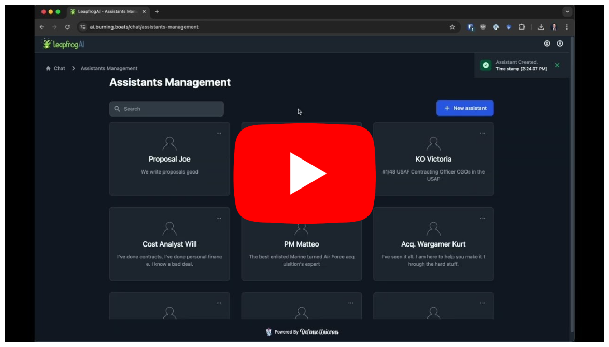

[](https://api.securityscorecards.dev/projects/github.com/defenseunicorns/leapfrogai)
[](https://github.com/defenseunicorns/leapfrogai/actions/workflows/nightly-snapshot-release.yaml)
[](https://github.com/defenseunicorns/leapfrogai/actions/workflows/nightly-uds-badge-verification.yaml)
[](https://github.com/defenseunicorns/leapfrogai/actions/workflows/weekly-registry1-flavor-test.yaml)

## Table of Contents

- [Overview](#overview)
- [Why Host Your Own LLM?](#why-host-your-own-llm)
- [Demo Video](#demo-video)
- [Structure](#structure)
- [Getting Started](#getting-started)
- [Components](#components)
  - [API](#api)
  - [SDK](#sdk)
  - [UI](#ui)
  - [Backends](#backends)
    - [Repeater](#repeater)
  - [Evaluations](#evaluations)
- [Usage](#usage)
- [Local Development](#local-development)
- [Contributing](#contributing)
- [Community](#community)

## Overview

LeapfrogAI is a self-hosted AI platform designed to be deployed in air-gapped environments. This project aims to bring sophisticated AI solutions to air-gapped resource-constrained environments, by enabling the hosting all requisite components of an AI stack.

Our services include vector databases, model backends, API, and UI. These capabilities can be easily accessed and integrated with your existing infrastructure, ensuring the power of AI can be harnessed irrespective of your environment's limitations.

## Why Host Your Own LLM?

Large Language Models (LLMs) are a powerful resource for AI-driven decision making, content generation, and more. How can LeapfrogAI bring AI to your mission?

- **Data Independence**: Sending sensitive information to a third-party service may not be suitable or permissible for all types of data or organizations. By hosting your own LLM, you retain full control over your data.

- **Scalability**: Pay-as-you-go AI services can become expensive, especially when large volumes of data are involved and require constant connectivity. Running your own LLM can often be a more cost-effective solution for missions of all sizes.

- **Mission Integration**: By hosting your own LLM, you have the ability to customize the model's parameters, training data, and more, tailoring the AI to your specific needs.

## Demo Video

<a href="https://www.youtube.com/watch?v=BowOJttHyPU" target="_blank">
 
</a>

LeapfrogAI is built on top of [Unicorn Delivery Service (UDS)](https://github.com/defenseunicorns/uds-core), Defense Unicorns' secure runtime environment, and includes several features such as:

- **Single Sign-On**
- **Non-proprietary API Compatible with OpenAI's API**
- **Retrieval Augmented Generation (RAG)**
- **Transcription and Translation**
- **And More!**

## Structure

The LeapfrogAI repository follows a monorepo structure based around an [API](#api) with each of the [components](#components) included in a dedicated `packages` directory. The UDS bundles that handle the development and latest deployments of LeapfrogAI are in the `bundles` directory. The structure looks as follows:

```bash
leapfrogai/
├── src/
│   ├── leapfrogai_api/   # source code for the API
│   ├── leapfrogai_evals/ # source code for the LeapfrogAI evaluation framework
│   ├── leapfrogai_sdk/   # source code for the SDK
│   └── leapfrogai_ui/    # source code for the UI
├── packages/
│   ├── api/              # deployment infrastructure for the API
│   ├── llama-cpp-python/ # source code & deployment infrastructure for the llama-cpp-python backend
│   ├── repeater/         # source code & deployment infrastructure for the repeater model backend
│   ├── supabase/         # deployment infrastructure for the Supabase backend and postgres database
│   ├── text-embeddings/  # source code & deployment infrastructure for the text-embeddings backend
│   ├── ui/               # deployment infrastructure for the UI
│   ├── vllm/             # source code & deployment infrastructure for the vllm backend
│   └── whisper/          # source code & deployment infrastructure for the whisper backend
├── bundles/
│   ├── dev/              # uds bundles for local uds dev deployments
│   └── latest/           # uds bundles for the most current uds deployments
├── tasks/                # uds task sub-modules (e.g., create, deploy, setup, etc.)
├── task.yaml             # uds tasks for declarative, local development and CI, workflows
├── Makefile
├── pyproject.toml
├── README.md
└── ...
```

## Getting Started

The preferred method for running LeapfrogAI is a local [Kubernetes](https://kubernetes.io/) deployment using [UDS](https://github.com/defenseunicorns/uds-core).

Please refer to the [Quick Start](https://docs.leapfrog.ai/docs/local-deploy-guide/quick_start/) section of the LeapfrogAI documentation website for system requirements and instructions.

## Components

### API

LeapfrogAI provides an [API](src/leapfrogai_api/) that closely matches that of OpenAI's. This feature allows tools that have been built with OpenAI/ChatGPT to function seamlessly with a LeapfrogAI backend.

### SDK

The LeapfrogAI [SDK](src/leapfrogai_sdk/) provides a standard set of protobufs and Python utilities for implementing backends with gRPC.

### UI

LeapfrogAI provides a [UI](src/leapfrogai_ui/) with support for common use-cases such as general chat and "Q&A with your documents".

### Backends

LeapfrogAI provides several backends for a variety of use cases. Below is the backends support and compatibility matrix:

| Backend                                        |  AMD64  |  ARM64  |  CUDA  | Docker | Kubernetes |   UDS   |
| ---------------------------------------------- | ------- | ------- | ------ | ------ | ---------- | ------- |
| [llama-cpp-python](packages/llama-cpp-python/) |   ✅   |   ✅   |   ✅   |   ✅   |     ✅     |   ✅   |
| [whisper](packages/whisper/)                   |   ✅   |   ✅   |   ✅   |   ✅   |     ✅     |   ✅   |
| [text-embeddings](packages/text-embeddings/)   |   ✅   |   ✅   |   ✅   |   ✅   |     ✅     |   ✅   |
| [vllm](packages/vllm/)                         |   ✅   | ❌[^1] |   ✅   |   ✅   |     ✅     |   ✅   |

[^1]: vLLM requires a CUDA-enabled PyTorch built for ARM64, which is not available via pip or conda

#### Repeater

The [repeater](packages/repeater/) "model" is a basic "backend" that parrots all inputs it receives back to the user. It is built out the same way all the actual backends are and it is primarily used for testing the API.

### Evaluations

LeapfrogAI comes with an evaluation framework that is integrated with [DeepEval](https://docs.confident-ai.com/). For more information on running and utilizing evaluations in LeapfrogAI, please see the [Evals README](/src/leapfrogai_evals/README.md).

### Flavors

Each component has different images and values that refer to a specific image registry and/or hardening source. These images are packaged using [Zarf Flavors](https://docs.zarf.dev/ref/examples/package-flavors/):

1. `upstream`: uses upstream vendor images from open source container registries and repositories
2. 🚧 `registry1`: uses [IronBank hardened images](https://repo1.dso.mil/dsop) from the Repo1 harbor registry

Below is the current component flavors list:

| Component                                      |  `upstream`  |  `registry1`  |
| ---------------------------------------------- | ------------ | ------------- |
| [api](packages/api/)                           |      ✅      |      ✅      |
| [ui](packages/ui/)                             |      ✅      |      ✅      |
| [supabase](packages/supabase/)                 |      ✅      |      🚧      |
| [migrations](./Dockerfile.migrations)          |      ✅      |      🚧      |
| [llama-cpp-python](packages/llama-cpp-python/) |      ✅      |      🚧      |
| [whisper](packages/whisper/)                   |      ✅      |      🚧      |
| [text-embeddings](packages/text-embeddings/)   |      ✅      |      🚧      |
| [vllm](packages/vllm/)                         |      ✅      |      🚧      |
| [vllm](packages/vllm/)                         |      ✅      |      🚧      |

Flavors with any components labelled as 🚧 are not available as a quick start bundle deployment yet. Please refer to the [DEVELOPMENT.md](./docs/DEVELOPMENT.md) for instructions on how to build a component's Zarf package for local testing.

## Usage

To build a LeapfrogAI UDS bundle and deploy it, please refer to the [LeapfrogAI Documentation Website](https://docs.leapfrog.ai/docs/). In the documentation website, you'll find system requirements and instructions for all things LeapfrogAI that aren't associated to local development and contributing.

For contributing and local deployment and development for each component in a local Python or Node.js environment please continue on to the [next section](#local-development).

## Local Development

> [!NOTE]
> Please start with the [LeapfrogAI documentation website](https://docs.leapfrog.ai/docs/local-deploy-guide/) prior to attempting local development

Each of the LeapfrogAI components can also be run individually outside of a Kubernetes or Containerized environment. This is useful when testing changes to a specific component, but will not assist in a full deployment of LeapfrogAI. Please refer to the [above section](#usage) for deployment instructions. Please refer to the [next section](#contributing) for rules on contributing to LeapfrogAI.

**_First_** refer to the [DEVELOPMENT.md](docs/DEVELOPMENT.md) document for general development details.

**_Then_** refer to the linked READMEs for each individual sub-directory's local development instructions.

- [SDK](src/leapfrogai_sdk/README.md)[^2]
- [API](packages/api/README.md)[^3]
- [UI](packages/ui/README.md)[^3]
- [LLaMA C++ Python](packages/llama-cpp-python/README.md)
- [vLLM](packages/vllm/README.md)
- [Supabase](packages/supabase/README.md)
- [Text Embeddings](packages/text-embeddings/README.md)
- [Faster Whisper](packages/whisper/README.md)
- [Repeater](packages/repeater/README.md)
- [Tests](tests/README.md)

[^2]: The SDK is not a functionally independent unit, and only becomes a functional unit when combined and packaged with the API and Backends as a dependency.

[^3]: Please be aware that the API and UI have artifacts under 2 sub-directories. The sub-directories related to `packages/` are focused on the Zarf packaging and Helm charts, whereas the sub-directories related to `src/` contains the actual source code and development instructions.

## Contributing

All potential and current contributors must ensure that they have read the [Contributing documentation](.github/CONTRIBUTING.md), [Security Policies](.github/SECURITY.md) and [Code of Conduct](.github/CODE_OF_CONDUCT.md) prior to opening an issue or pull request to this repository.

When submitting an issue or opening a PR, please first ensure that you have searched your potential issue or PR against the existing or closed issues and PRs. Perceived duplicates will be closed, so please reference and differentiate your contributions from tangential or similar issues and PRs.

## Community

LeapfrogAI is supported by a community of users and contributors, including:

- [Defense Unicorns](https://defenseunicorns.com)
- [Beast Code](https://beast-code.com)
- [Chainguard](https://www.chainguard.dev/)
- [Exovera](https://exovera.com/)
- [Hypergiant](https://www.hypergiant.com/)
- [Pulze](https://www.pulze.ai)
- [SOSi](https://www.sosi.com/)
- [United States Navy](https://www.navy.mil/)
- [United States Air Force](https://www.airforce.com)
- [United States Space Force](https://www.spaceforce.mil)

[](https://defenseunicorns.com)[](https://beast-code.com)[](https://hypergiant.com)[](https://pulze.ai)

_Want to add your organization or logo to this list? [Open a PR!](https://github.com/defenseunicorns/leapfrogai/edit/main/README.md)_
