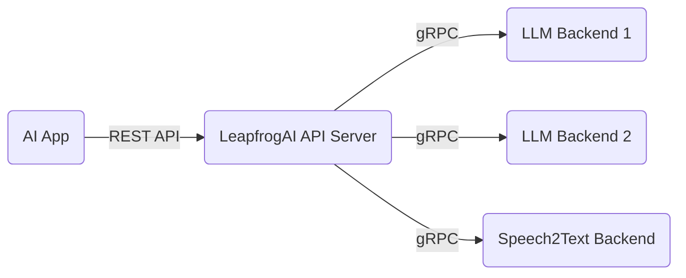
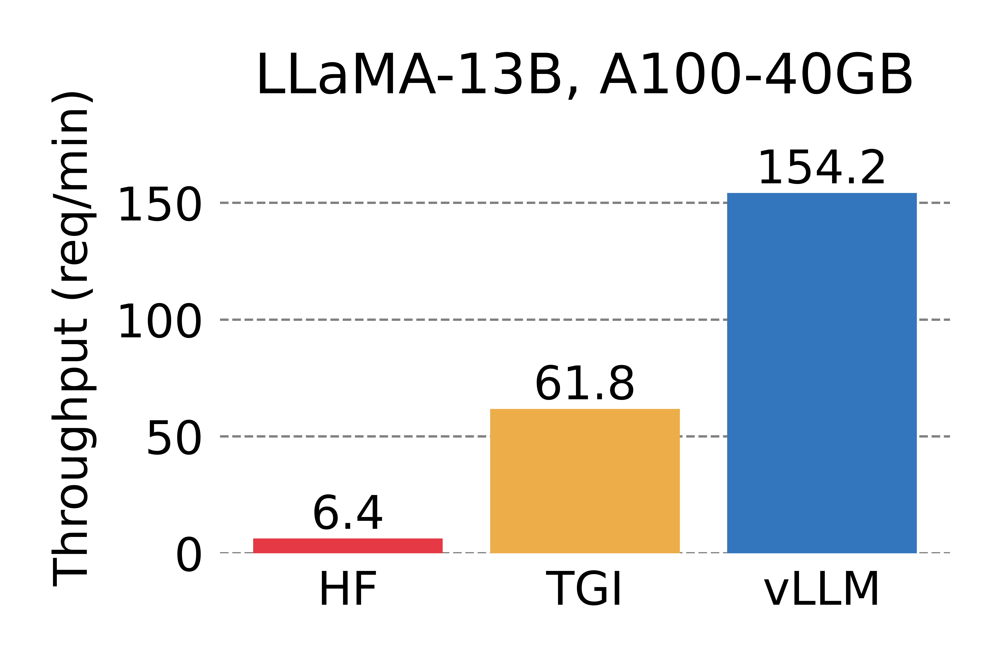
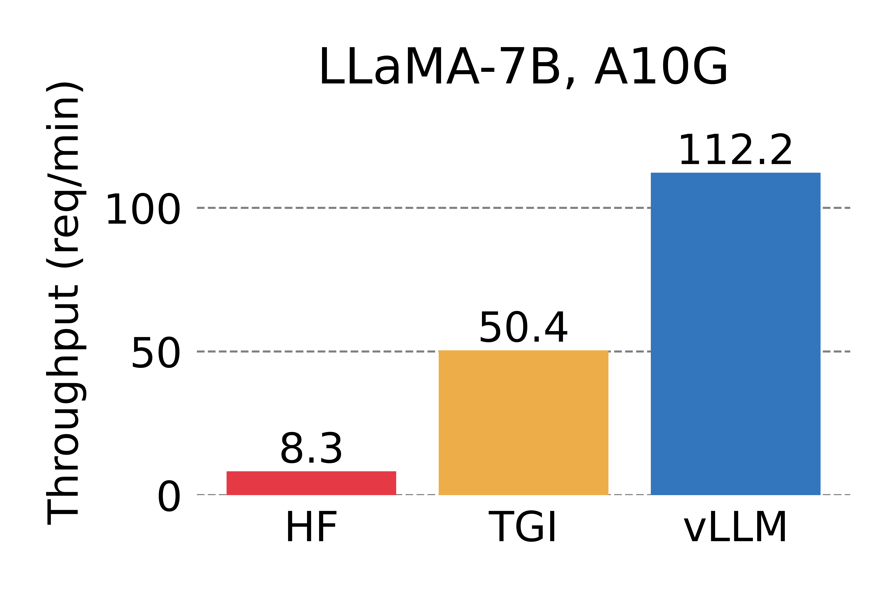

# LLM Backend 

## Table of Contents

- [LLM Backend](#llm-backend)
  - [Table of Contents](#table-of-contents)
  - [Status](#status)
  - [Background](#background)
  - [Decision](#decision)
  - [Rationale](#rationale)
  - [Alternatives](#alternatives)
  - [Related ADRs](#related-adrs)
  - [References](#references)

## Status

ACCEPTED

## Background

This ADR recommends a standard backend for the majority of LeapfrogAI and discusses the tradeoffs with this decision.

Backends are an integral part of the data plane for LeapfrogAI, acting as the engine that is executing inferencing from the API endpoints. Open source backends exist for different hardware profiles, at different maturity levels, and targeting different features and LLM architectures.

As a reference, the general architecture for LeapfrogAI is a series of microservices, with inferencing backends communicating with and aggregated by the API server over gRPC.

**LeapfrogAI Architecture**

There is a large set of permutations of hardware, LLM backends, LLM architectures, and file formats that go into the decision of choosing a backend. The LeapfrogAI project itself provides an SDK to quickly bind these backends, but for team scalability will support a subset of backends and enable the community to support the backends for use cases not targeted by the LeapfrogAI core team.

There is a significant gap in backends designed for large-scale SaaS operations and smaller scale CPU inferencing, especially in batching and concurrency. Additionally, different backends support different methods and sizes of quantization.

## Decision

Initially, the priority for backend support will focus on GPU and concurrent serving of requests as high priority features for LeapfrogAI developers.

Primary Support: For most use cases we will support [vLLM](https://github.com/vllm-project/vllm), which requires a GPU to function.

Secondary Support: For single user instances (arm64/and64 Mac/Linux) we will support [Llama-cpp-python](https://github.com/abetlen/llama-cpp-python), which runs well on most CPUs.

## Rationale

Assumptions:

* GPU-only is an acceptable tradeoff for production LLM deployments
* Flash Attention / other batching and concurrency features are required for production LLM use cases
* Must support LLM architectures commonly in use in the community

Pros:

* vLLM is supported by a large community and has a frequent release cadence of bug fixes and features.
* vLLM supports concurrent request
* vLLM support a higher volume of request that other popular LLM frameworks.

  
  

> Reference: <https://blog.vllm.ai/2023/06/20/vllm.html>

Cons:

* vLLM does not support CPU inferencing.
* vLLM requires GPUs - in our case we are targeting modern NVIDIA GPUs (Turing Architecture and newer).
* vLLM does not currently support many forms of quantization - this means our models may require more VRAM which will increase cloud/hardware costs.

## Alternatives

[llama-cpp-python](https://github.com/abetlen/llama-cpp-python): We have been primarily supported llama-cpp-python as our backend to this point. We intend to continue to support it for CPU-only inferencing. Maintaining GPU images for llama-cpp-python has been time consuming as it requires us to handle the friction between nvidia drivers and statically compiled Cuda libraries. Thus we will no longer support llama-cpp-python GPU instance and we will use VLLM for GPU use cases.

[ctransformers](https://github.com/marella/ctransformers): We previously supported ctransformers as a backend for CPU and were working to develop a GPU image for it. Given this backend hasn't been updated in 6+ months, we assume the community has withdrawn support for it and we have deprecated all instances where that backend was used within LeapfrogAI.

We did some high level investigation of other engines in reaching the conclusions stated here, but did not include further discussion as we did not extensively test them. If further investigation into other backends is warranted please open and issue or PR on this repo.

## Related ADRs

None

## References

1. vLLM Project: <https://github.com/vllm-project/vllm>
2. llama-cpp-python Project: [https://github.com/abetlen/llama-cpp-python](https://github.com/abetlen/llama-cpp-python)
3. ctransformers Project: [https://github.com/marella/ctransformers](https://github.com/marella/ctransformers)
4. vLLM Blog Post: [https://blog.vllm.ai/2023/06/20/vllm.html](https://blog.vllm.ai/2023/06/20/vllm.html)
