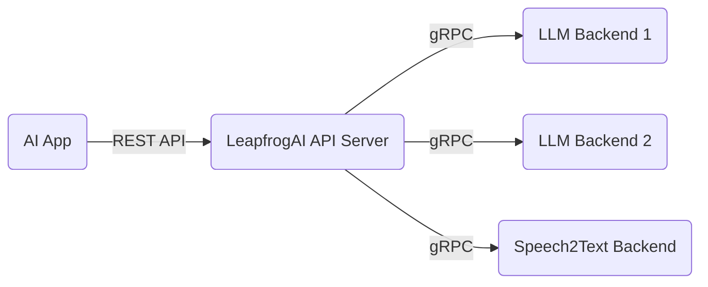

# LLM Backend 

## Table of Contents

- [LLM Backend](#llm-backend)
  - [Table of Contents](#table-of-contents)
  - [Summary](#summary)
    - [Issue](#issue)
    - [Decision](#decision)
    - [Rationale](#rationale)
    - [Status](#status)
  - [Context](#context)
    - [Important Factors](#important-factors)
    - [Options](#options)
    - [Supporting information](#supporting-information)
      - [Benchmarks](#benchmarks)
    - [Indexing](#indexing)
    - [Assumptions](#assumptions)
    - [Constraints](#constraints)
    - [Implications](#implications)

## Summary

Backends are an integral part of the data plane for LeapfrogAI, acting as the engine that is executing inferencing from the API endpoints. Open source backends exist for different hardware profiles, at different maturity levels, and targeting different features and LLM architectures.

This ADR recommends a general purpose backend for the majority of LeapfrogAI work.

As a reference, the general architecture for LeapfrogAI is a series of microservices, with inferencing backends communicating with and aggregated by the API server over gRPC.

**LeapfrogAI Architecture**

### Issue

There is a large set of permeutations of hardware, LLM backends, LLM architectures, and file formats that go into the decision of choosing a backend. The LeapfrogAI project itself provides an SDK to quickly bind these backends, but for team scalability will support a subset of backends and enable the community to support the backends for use cases not targeted by the LeapfrogAI core team.

There is a significant gap in backends designed for large-scale SaaS operations and smaller scale CPU inferencing, especially in batching and concurrency. Additionally, different backends support different methods and sizes of quantization.

Initially, the priority for backend support will focus on GPU and concurrent serving of requests as high priority features for LeapfrogAI developers.

### Decision

[vLLM](https://github.com/vllm-project/vllm)

### Rationale

* vLLM a robust, production-ready framework with best-in-class support for concurrent inferencing requests
* vLLM requires GPUs
* Does not currently support many forms of quantization - int8 is a possibility, but fp16 is the default
* Most complicated engine, but best supports the GPU and concurrency requirements for LeapfrogAI.

### Status

Pending (In-Progress)

## Context

### Important Factors

**Feature priority**:

- Concurrent requests / batching
- GPU support
- Quantization support
- CPU Support
- Advanced feature (LoRA / QLoRA / ROPE / Alibi) support

### Options

- TGI
- vLLM
- Transformers
- Llama.cpp
- llama-cpp-python
- Lorax
- text-generation-inference
- ctranslate2
- TensorRT-LLM
- candle
- burn

### Assumptions

* GPU-only is an acceptable tradeoff for MVP
* Flash Attention / other batching and concurrency features are required
* Must run LLM architectures commonly in use in the community

### Constraints

* Lack of quantization and CPU support limits deployment footprints. LFAI deployments will have a larger minimum system requirements
