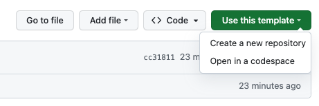

# Doc Site Template

[](https://github.com/defenseunicorns/doc-site-template/actions)

This site uses the [Defense Unicorns](https://github.com/defenseunicorns/defense-unicorns-hugo-theme) theme for Hugo
which is a fork of the Google Docsy theme. The Docsy documentation can be used as a guide for [building content](https://www.docsy.dev/docs/adding-content/).

## Contributing

This repository enforces [Conventional Commit](https://www.conventionalcommits.org/en/v1.0.0/) messages. See the
documentation for [`release-please`](https://github.com/googleapis/release-please#how-should-i-write-my-commits) for correctly formatting commit messages. [This video](https://www.youtube.com/watch?v=lwGcnDgwmFc&ab_channel=Syntax) does a good job of showing how to add the `Conventional Commit` VSCode extension to use when creating the commit messages.

#### Prerequisites 

[Hugo](https://gohugo.io/documentation/) is required in order to utilize the doc site template. You can run `brew install hugo` to quickly install or see the [installation page](https://gohugo.io/installation/) for additional install methods.

## Getting Started

Create a new repository from this template:



Clone your new site:

```bash
git clone <git repo>
cd <new repo>
npm ci
```

To run the site for local development:

```bash
npm start
```

Then navigate to [http://localhost:1313/](http://localhost:1313/)

## Style guide

You can modify the color theme to match your product's by changing the `$secondary` color variable in [_variables_project.scss](assets/scss/_variables_project.scss).

[Color Palette](https://www.figma.com/file/aNnt9Ip7IFTs9hnfqrYGl4/Unicorn-UI?type=design&mode=design)

To modify the favicon, replace the Doug icons in `static/favicons` with the icons of your choosing. You can use
[IconGen](http://cthedot.de/icongen) to create the icons in the multiple sizes needed. Make sure and replace all of the
sizes or it will use the theme's default of Doug.

To modify the logo on your Navbar, change the `navbar_logo` setting under `params.ui` in `hugo.toml`. The logo should be
an SVG.
